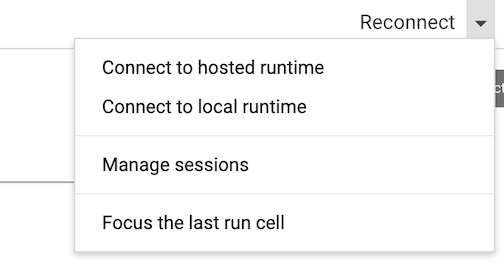

# Software Engineering for MR Scientists
## Basic Python Programming

Tutorial presented at [ISMRM 2021](https://www.ismrm.org/21m/) by [Saige Rutherford](https://www.beingsaige.com/).


We will be running all of our code in Google Colab python notebooks. These are essentially python Jupyter notebooks run in the :cloud: *cloud* :cloud:. 
Running our code using Colab will save us from dealing with python library installation and virtual environment setup. The tutorial contains [links](https://python.land/installing-python) for how to install python on your own computer, and if you prefer to do that rather than use Google Colab, please feel free to do so.  

If you have never used Google Colab before, you can check out an into notebook with lots of helpful links here: [](https://colab.research.google.com/notebooks/intro.ipynb)

### :warning: Setup instructions for Google Colab :warning:
You can open the python notebook that we will use in this practical directly from this Github account (the links to the notebook are at the bottom of this Read Me file). Before you open the notebook, make sure you are logged into a Google account. All of the code has been tested using Google Chrome web browser. When you are ready to begin, you will click on the **template** Google Colab button below. This will launch a new browser tab with the Google Colab notebook. 

Once you are in the Colab notebook tab, in the top right corner you will see a `Connect` (or `Reconnect`) button. Click on this, and a dropdown menu will appear as shown below. Click on `Connect to hosted runtime` this will allow you to run the notebook using Google’s cloud resources, which are likely much faster than your computer. If you would prefer to use your own computer’s resources (this is not recommended and instructors will not be able to help you troubleshoot if you are not running the notebook in the cloud), select `Connect to local runtime`. 

:warning: Note: sometimes if the notebook is left running for a long time without any activity (i.e. your computer goes to sleep), you will be disconnected from the runtime. In that case, you will need to click on this same button. It will appear as `Reconnect` instead of `Connect`. You will also need to  re-run all code blocks. 




:arrow_right: In the Colab python notebook, there are 2 types of cells: text cells & ```code cells```. The text cells have plain text in them, that the notebook will not interpret as code. These are the cells that contain the background information, helpful tips, and instructions. The ```code``` cells have a :arrow_forward: play button on the left side. These are the cells that the notebook will run as code. To run a ```code cell```, you can either click on the play button :arrow_forward: on the left side or use ‘Shift + Enter’ (your cursor must be inside the code cell). 
 
### Now you are ready to begin coding! 
### Good luck :four_leaf_clover: and remember to have fun :smiley:! 

The **template** notebook you will be filling out during this tutorial can be launched here (remember, you need to be signed in to a Google account in your internet browser, for best results, use Chrome): [](https://colab.research.google.com/github/saigerutherford/introduction-to-python/blob/master/introduction-to-python.ipynb)

If you get stuck and need guidance, there is a filled out answer key :key: notebook here: [](https://colab.research.google.com/github/saigerutherford/introduction-to-python/blob/master/introduction-to-python-key.ipynb)